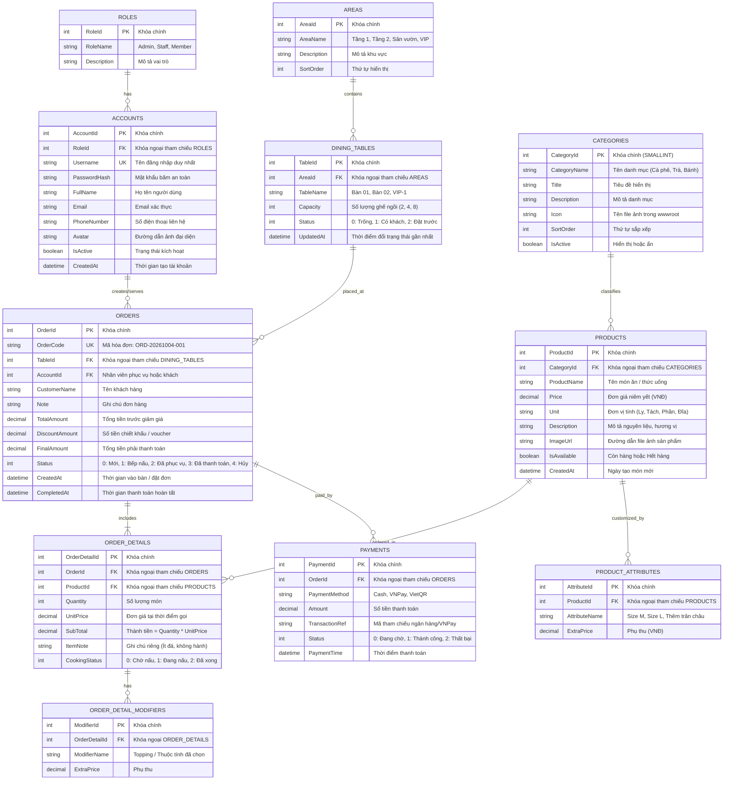
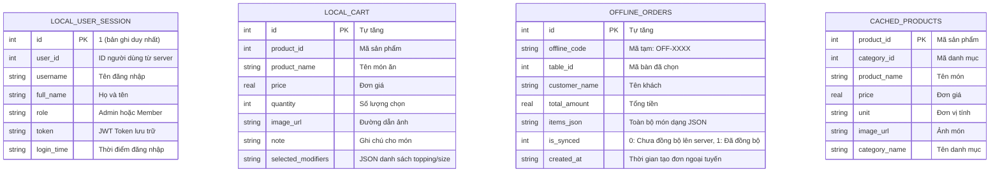

# THIẾT KẾ CƠ SỞ DỮ LIỆU CHUYÊN NGHIỆP (MERMAID ERD & SQL SCHEMA)
**Hệ thống:** Restaurant & Cafe Management POS
**Kiến trúc Lưu trữ:** Microsoft SQL Server (Backend Central DB) + SQLite (Mobile Local DB)

---

## I. SƠ ĐỒ THỰC THỂ QUAN HỆ CHUYÊN NGHIỆP (MERMAID ERD)



---

## II. SƠ ĐỒ SQLITE TRÊN ĐIỆN THOẠI DI ĐỘNG (MOBILE LOCAL DB)

Nhằm đáp ứng yêu cầu vận hành mượt mà, lưu trữ cục bộ và khả năng hoạt động ngoại tuyến (Offline First), cơ sở dữ liệu SQLite trong ứng dụng Flutter được thiết kế tinh gọn nhưng đầy đủ:



---

## III. SCRIPT TẠO DATABASE TRÊN MICROSOFT SQL SERVER (T-SQL READY)

```sql
-- SCRIPT TẠO DATABASE QUẢN LÝ NHÀ HÀNG & QUÁN CÀ PHÊ POS
-- CHẠY TRÊN SQL SERVER MANAGEMENT STUDIO (SSMS)
USE master;
GO

IF NOT EXISTS (SELECT name FROM sys.databases WHERE name = 'RestaurantPosDb')
BEGIN
    CREATE DATABASE RestaurantPosDb;
END
GO

USE RestaurantPosDb;
GO

-- 1. BẢNG VAI TRÒ (ROLES)
IF OBJECT_ID('Roles', 'U') IS NULL
CREATE TABLE Roles (
    RoleId INT IDENTITY(1,1) PRIMARY KEY,
    RoleName NVARCHAR(32) NOT NULL UNIQUE,
    Description NVARCHAR(256) NULL
);
GO

-- 2. BẢNG TÀI KHOẢN (ACCOUNTS)
IF OBJECT_ID('Accounts', 'U') IS NULL
CREATE TABLE Accounts (
    AccountId INT IDENTITY(1,1) PRIMARY KEY,
    RoleId INT NOT NULL CONSTRAINT FK_Accounts_Roles REFERENCES Roles(RoleId),
    Username VARCHAR(64) NOT NULL UNIQUE,
    PasswordHash VARCHAR(256) NOT NULL,
    FullName NVARCHAR(128) NOT NULL,
    Email VARCHAR(128) NULL,
    PhoneNumber VARCHAR(20) NULL,
    Avatar NVARCHAR(256) NULL,
    IsActive BIT NOT NULL DEFAULT 1,
    CreatedAt DATETIME NOT NULL DEFAULT GETDATE()
);
GO

-- 3. BẢNG KHU VỰC (AREAS)
IF OBJECT_ID('Areas', 'U') IS NULL
CREATE TABLE Areas (
    AreaId INT IDENTITY(1,1) PRIMARY KEY,
    AreaName NVARCHAR(64) NOT NULL,
    Description NVARCHAR(256) NULL,
    SortOrder INT NOT NULL DEFAULT 0
);
GO

-- 4. BẢNG BÀN ĂN (DINING_TABLES)
IF OBJECT_ID('DiningTables', 'U') IS NULL
CREATE TABLE DiningTables (
    TableId INT IDENTITY(1,1) PRIMARY KEY,
    AreaId INT NOT NULL CONSTRAINT FK_Tables_Areas REFERENCES Areas(AreaId),
    TableName NVARCHAR(64) NOT NULL,
    Capacity INT NOT NULL DEFAULT 4,
    Status INT NOT NULL DEFAULT 0, -- 0: Trống, 1: Đang có khách, 2: Đã đặt trước
    UpdatedAt DATETIME NOT NULL DEFAULT GETDATE()
);
GO

-- 5. BẢNG DANH MỤC SẢN PHẨM (CATEGORIES)
IF OBJECT_ID('Categories', 'U') IS NULL
CREATE TABLE Categories (
    CategoryId SMALLINT IDENTITY(1,1) PRIMARY KEY,
    CategoryName NVARCHAR(64) NOT NULL,
    Title NVARCHAR(128) NOT NULL,
    Description NVARCHAR(512) NOT NULL,
    Icon NVARCHAR(256) NOT NULL,
    SortOrder INT NOT NULL DEFAULT 0,
    IsActive BIT NOT NULL DEFAULT 1
);
GO

-- 6. BẢNG SẢN PHẨM / MÓN ĂN (PRODUCTS)
IF OBJECT_ID('Products', 'U') IS NULL
CREATE TABLE Products (
    ProductId INT IDENTITY(1,1) PRIMARY KEY,
    CategoryId SMALLINT NOT NULL CONSTRAINT FK_Products_Categories REFERENCES Categories(CategoryId),
    ProductName NVARCHAR(128) NOT NULL,
    Price DECIMAL(18,2) NOT NULL,
    Unit NVARCHAR(32) NOT NULL DEFAULT N'Phần',
    Description NVARCHAR(1024) NULL,
    ImageUrl NVARCHAR(256) NOT NULL,
    IsAvailable BIT NOT NULL DEFAULT 1,
    CreatedAt DATETIME NOT NULL DEFAULT GETDATE()
);
GO

-- 7. BẢNG THUỘC TÍNH SẢN PHẨM (PRODUCT_ATTRIBUTES)
IF OBJECT_ID('ProductAttributes', 'U') IS NULL
CREATE TABLE ProductAttributes (
    AttributeId INT IDENTITY(1,1) PRIMARY KEY,
    ProductId INT NOT NULL CONSTRAINT FK_Attributes_Products REFERENCES Products(ProductId) ON DELETE CASCADE,
    AttributeName NVARCHAR(64) NOT NULL,
    ExtraPrice DECIMAL(18,2) NOT NULL DEFAULT 0
);
GO

-- 8. BẢNG HÓA ĐƠN / ĐƠN HÀNG (ORDERS)
IF OBJECT_ID('Orders', 'U') IS NULL
CREATE TABLE Orders (
    OrderId INT IDENTITY(1,1) PRIMARY KEY,
    OrderCode VARCHAR(32) NOT NULL UNIQUE,
    TableId INT NULL CONSTRAINT FK_Orders_Tables REFERENCES DiningTables(TableId),
    AccountId INT NULL CONSTRAINT FK_Orders_Accounts REFERENCES Accounts(AccountId),
    CustomerName NVARCHAR(128) NULL,
    Note NVARCHAR(512) NULL,
    TotalAmount DECIMAL(18,2) NOT NULL DEFAULT 0,
    DiscountAmount DECIMAL(18,2) NOT NULL DEFAULT 0,
    FinalAmount DECIMAL(18,2) NOT NULL DEFAULT 0,
    Status INT NOT NULL DEFAULT 0, -- 0: Mới, 1: Đang chế biến, 2: Đã phục vụ, 3: Hoàn thành, 4: Hủy
    CreatedAt DATETIME NOT NULL DEFAULT GETDATE(),
    CompletedAt DATETIME NULL
);
GO

-- 9. BẢNG CHI TIẾT ĐƠN HÀNG (ORDER_DETAILS)
IF OBJECT_ID('OrderDetails', 'U') IS NULL
CREATE TABLE OrderDetails (
    OrderDetailId INT IDENTITY(1,1) PRIMARY KEY,
    OrderId INT NOT NULL CONSTRAINT FK_OrderDetails_Orders REFERENCES Orders(OrderId) ON DELETE CASCADE,
    ProductId INT NOT NULL CONSTRAINT FK_OrderDetails_Products REFERENCES Products(ProductId),
    Quantity INT NOT NULL DEFAULT 1,
    UnitPrice DECIMAL(18,2) NOT NULL,
    SubTotal DECIMAL(18,2) NOT NULL,
    ItemNote NVARCHAR(256) NULL,
    CookingStatus INT NOT NULL DEFAULT 0 -- 0: Chờ nấu, 1: Đang nấu, 2: Xong
);
GO

-- 10. BẢNG GIAO DỊCH THANH TOÁN (PAYMENTS)
IF OBJECT_ID('Payments', 'U') IS NULL
CREATE TABLE Payments (
    PaymentId INT IDENTITY(1,1) PRIMARY KEY,
    OrderId INT NOT NULL CONSTRAINT FK_Payments_Orders REFERENCES Orders(OrderId),
    PaymentMethod VARCHAR(32) NOT NULL, -- Cash, VNPay, VietQR
    Amount DECIMAL(18,2) NOT NULL,
    TransactionRef VARCHAR(128) NULL,
    Status INT NOT NULL DEFAULT 1, -- 0: Chờ, 1: Thành công, 2: Thất bại
    PaymentTime DATETIME NOT NULL DEFAULT GETDATE()
);
GO

-- DỮ LIỆU MẪU BAN ĐẦU (SEED DATA)
SET IDENTITY_INSERT Roles ON;
INSERT INTO Roles (RoleId, RoleName, Description) VALUES
(1, 'Admin', N'Quản trị viên toàn quyền hệ thống'),
(2, 'Staff', N'Nhân viên phục vụ & thu ngân'),
(3, 'Member', N'Khách hàng thân thiết');
SET IDENTITY_INSERT Roles OFF;
GO

SET IDENTITY_INSERT Areas ON;
INSERT INTO Areas (AreaId, AreaName, Description, SortOrder) VALUES
(1, N'Tầng trệt (Trong nhà)', N'Khu vực máy lạnh yên tĩnh', 1),
(2, N'Tầng 1 (Ban công)', N'Khu vực thoáng ngắm cảnh', 2),
(3, N'Sân vườn', N'Khu vực cây xanh ngoài trời', 3);
SET IDENTITY_INSERT Areas OFF;
GO

SET IDENTITY_INSERT DiningTables ON;
INSERT INTO DiningTables (TableId, AreaId, TableName, Capacity, Status) VALUES
(1, 1, N'Bàn 01', 4, 0),
(2, 1, N'Bàn 02', 4, 0),
(3, 1, N'Bàn 03', 2, 0),
(4, 2, N'Bàn L1-01', 6, 0),
(5, 2, N'Bàn L1-02', 4, 0),
(6, 3, N'Bàn SV-01', 8, 0);
SET IDENTITY_INSERT DiningTables OFF;
GO

SET IDENTITY_INSERT Categories ON;
INSERT INTO Categories (CategoryId, CategoryName, Title, Description, Icon, SortOrder, IsActive) VALUES
(1, N'Cà phê', N'Cà phê truyền thống & pha máy', N'Cà phê rang mộc nguyên chất đậm đà phong vị Việt Nam', 'coffee.png', 1, 1),
(2, N'Trà & Trà sữa', N'Trà trái cây nhiệt đới & Trà sữa', N'Trà tươi ủ mới mỗi ngày cùng trân châu dai giòn thơm ngon', 'milk_tea.png', 2, 1),
(3, N'Bánh & Tráng miệng', N'Bánh ngọt & Món ăn nhẹ', N'Bánh ngọt phong cách Pháp và đồ ăn vặt hấp dẫn', 'bakery.png', 3, 1);
SET IDENTITY_INSERT Categories OFF;
GO

SET IDENTITY_INSERT Products ON;
INSERT INTO Products (ProductId, CategoryId, ProductName, Price, Unit, Description, ImageUrl, IsAvailable) VALUES
(1, 1, N'Cà phê đen đá', 25000, N'Ly', N'Cà phê Robusta Đắk Lắk pha phin truyền thống', 'cafe_den.jpg', 1),
(2, 1, N'Cà phê sữa đá', 29000, N'Ly', N'Hòa quyện giữa vị đắng đậm và sữa đặc béo ngậy', 'cafe_sua.jpg', 1),
(3, 1, N'Bạc xỉu 3 tầng', 35000, N'Ly', N'Cà phê nhiều sữa thơm béo thích hợp cho giới trẻ', 'bac_xiu.jpg', 1),
(4, 2, N'Trà đào cam sả', 42000, N'Ly', N'Vị thanh ngọt của đào kết hợp hương sả thơm lừng', 'tra_dao.jpg', 1),
(5, 2, N'Trà sữa trân châu hoàng gia', 45000, N'Ly', N'Trà đen đậm đà kèm trân châu đen dẻo dai', 'tra_sua.jpg', 1),
(6, 3, N'Bánh Tiramisu', 39000, N'Phần', N'Bánh ngọt Ý vị cà phê và phô mai mascarpone', 'tiramisu.jpg', 1);
SET IDENTITY_INSERT Products OFF;
GO
```
