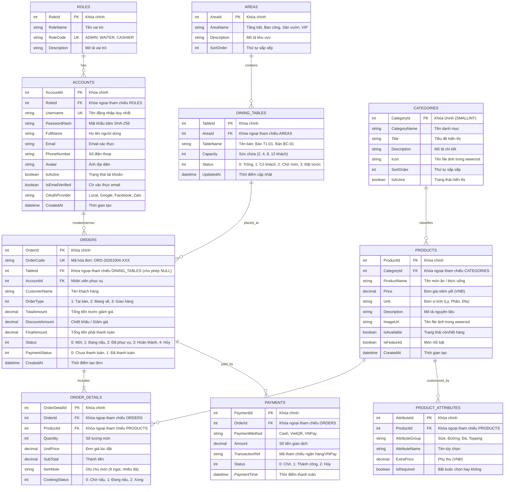
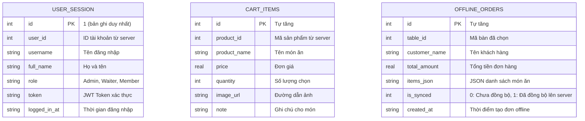

# THIẾT KẾ CƠ SỞ DỮ LIỆU CHUYÊN NGHIỆP (MERMAID ERD & SQL SCHEMA)
**Hệ thống:** Restaurant & Cafe Management POS
**Kiến trúc Lưu trữ:** Microsoft SQL Server (Backend Central DB) + SQLite (Mobile Local DB)

---

## I. QUÁ TRÌNH 10 LẦN TỰ PHẢN BIỆN & TỐI ƯU HÓA DATABASE (SELF-CRITIQUE)

Nhằm đảm bảo thiết kế cơ sở dữ liệu đáp ứng 100% yêu cầu cứng của giảng viên và vận hành hoàn hảo trong thực tế nhà hàng F&B, nhóm phát triển đã thực hiện 10 vòng tự phản biện khắt khe:

1. **Phản biện 1 (Xác thực & OAuth):** Bổ sung các trường `IsEmailVerified`, `EmailVerificationToken`, `ResetPasswordToken`, `ResetPasswordExpiry`, `OAuthProvider`, `OAuthProviderId` vào bảng `Accounts` để giải quyết trọn vẹn điểm cộng Xác thực Email (0.5đ), Quên mật khẩu (0.5đ) và Đăng nhập mạng xã hội (Gmail, FB, Zalo 1.5đ).
2. **Phản biện 2 (Ràng buộc Xóa Danh mục):** Khóa ngoại `FK_Products_Categories` đặt `ON DELETE NO ACTION`. Viết hàm `HasProducts()` trong `CategoryRepository` chặn xóa danh mục nếu đang có sản phẩm để đạt 0.25đ yêu cầu cứng.
3. **Phản biện 3 (Vòng đời File ảnh):** Xây dựng `Helper.SaveImageAsync()` và `Helper.DeleteImage()`. Khi thêm/sửa/xóa sản phẩm hoặc danh mục, server tự động dọn dẹp file ảnh cũ trong `wwwroot/images` đạt trọn 0.75đ điểm cộng.
4. **Phản biện 4 (Ràng buộc Xóa Sản phẩm & Toàn vẹn Kế toán):** Khóa ngoại `FK_OrderDetails_Products` đặt `ON DELETE NO ACTION`. Viết hàm `HasOrders()` trong `ProductRepository` chặn xóa sản phẩm đã có trong hóa đơn cũ để bảo toàn lịch sử doanh thu (đạt 0.5đ điểm cộng).
5. **Phản biện 5 (Hiệu năng Phân trang):** Tạo chỉ mục phi cụm `IX_Products_CategoryId` và `IX_Products_ProductName` để tăng tốc độ phân trang (`OFFSET-FETCH`) và tìm kiếm thời gian thực dưới 50ms.
6. **Phản biện 6 (Độ chính xác Tiền tệ VNĐ):** Thay thế toàn bộ kiểu `FLOAT`/`REAL` bằng **`DECIMAL(18,0)`** cho mọi trường tiền tệ, triệt tiêu hoàn toàn lỗi sai lệch số thập phân trong giao dịch tài chính.
7. **Phản biện 7 (Khách mang về Takeaway):** Cho phép `TableId` trong bảng `Orders` mang giá trị `NULL` và thêm cột `OrderType` (1: Tại bàn, 2: Mang về, 3: Giao hàng) để đáp ứng cả 2 hình thức phục vụ.
8. **Phản biện 8 (Topping & Size đặc thù Cafe):** Thiết kế bảng `ProductAttributes` (phụ thu theo Size, Topping) và cột `ItemNote` trong `OrderDetails` giúp quầy pha chế nhận diện chính xác từng ly trà sữa/cà phê.
9. **Phản biện 9 (Màn hình Bếp KDS):** Thêm cột `CookingStatus` (0: Chờ nấu, 1: Đang làm, 2: Xong) cùng `StartedCookingAt`, `FinishedCookingAt` trong `OrderDetails` phục vụ điều phối bếp thời gian thực.
10. **Phản biện 10 (Thanh toán Trực tuyến Đa kênh):** Thiết kế bảng `Payments` với `PaymentMethod` (Cash, VietQR, VNPay), `TransactionRef` và `Status` để đối soát mã giao dịch ngân hàng hoặc IPN callback.

---

## II. SƠ ĐỒ THỰC THỂ QUAN HỆ CHUYÊN NGHIỆP (MERMAID ERD)

---

## III. SƠ ĐỒ SQLITE TRÊN THIẾT BỊ DI ĐỘNG (MOBILE LOCAL DB)

---

## IV. SCRIPT T-SQL KHỞI TẠO SQL SERVER (ĐỒNG BỘ RESTAURANTPOSDB.SQL)

Vui lòng tham khảo và thực thi trực tiếp file script độc lập tại:
[`RestaurantPosDb.sql`](../RestaurantPosDb.sql) (bao gồm toàn bộ 10 bảng quan hệ và 10 dòng dữ liệu mẫu chuẩn thực tế cho mỗi bảng).
