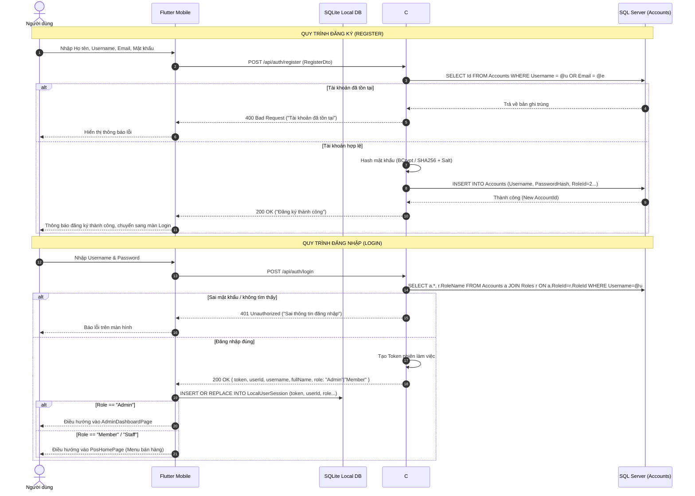
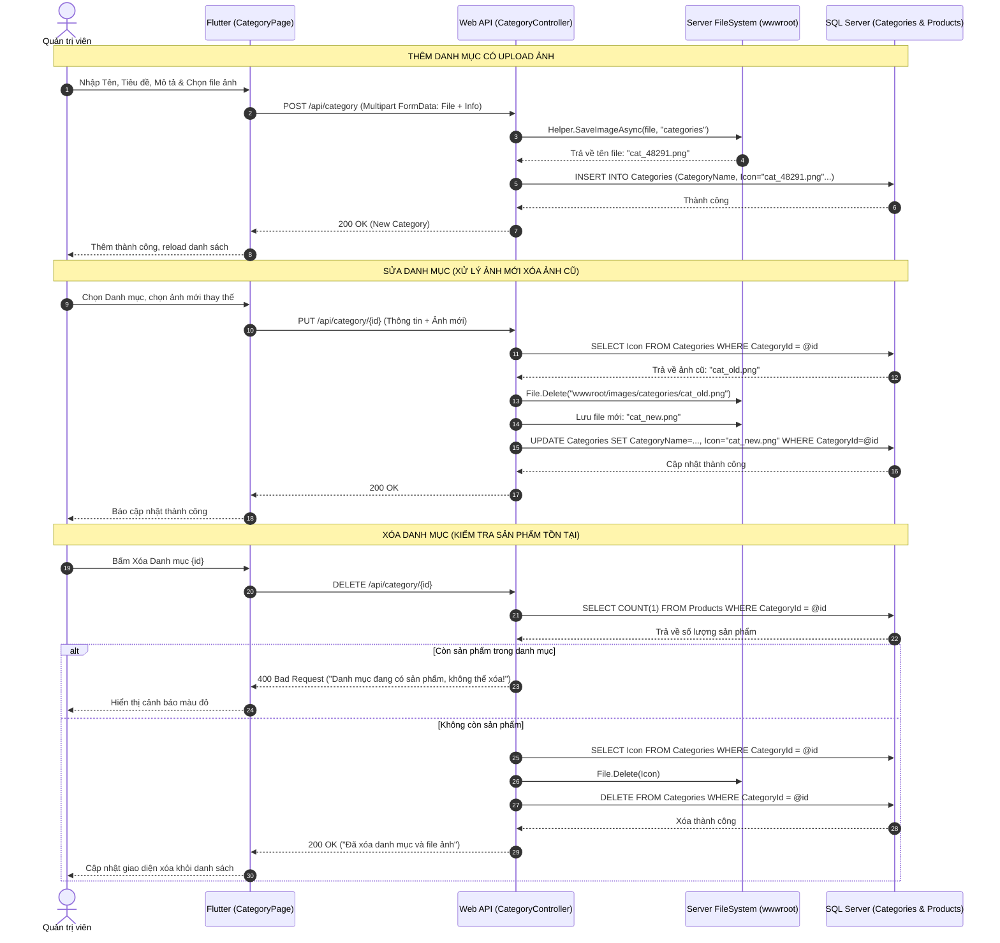
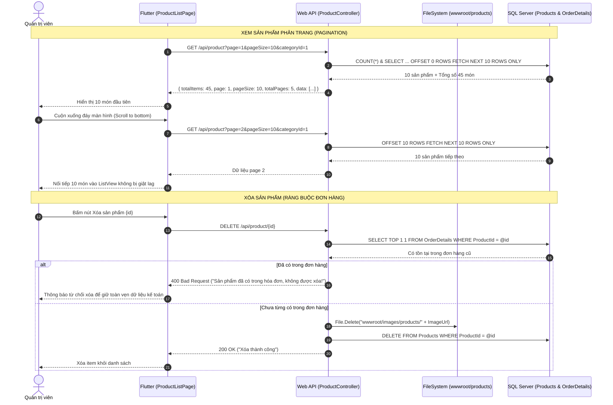
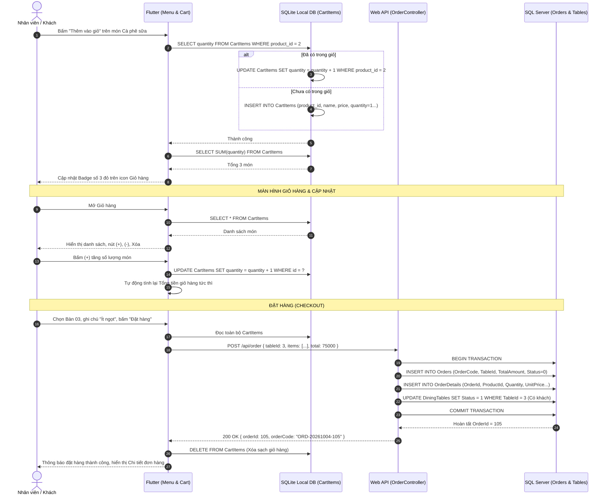
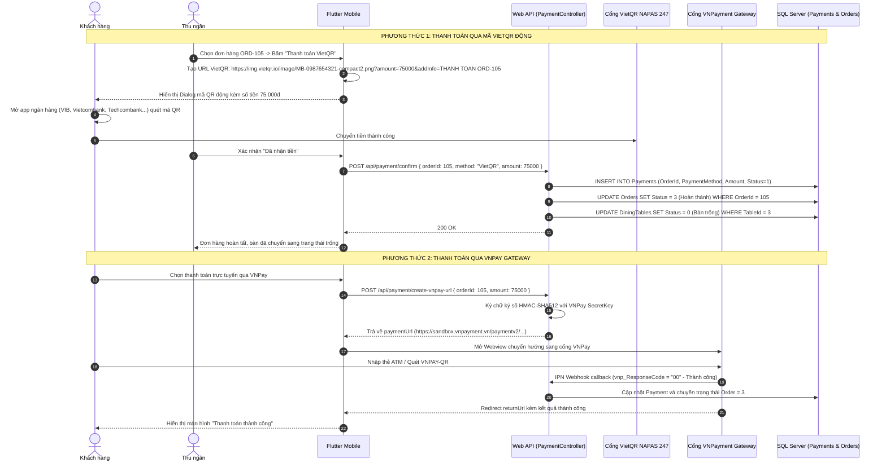
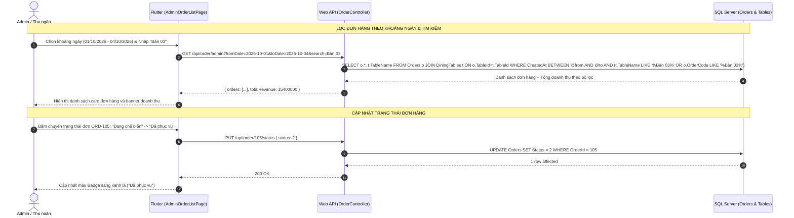
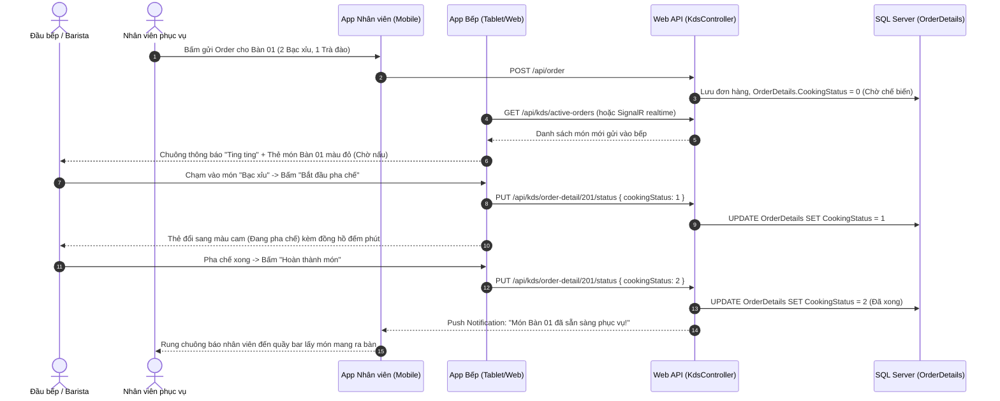

# HỆ THỐNG MERMAID SEQUENCE FLOWS CHI TIẾT TỪNG CHỨC NĂNG
**Toàn bộ sơ đồ luồng hoạt động tuần tự (Sequence Diagrams) từ Giao diện Mobile $\rightarrow$ SQLite $\rightarrow$ REST API $\rightarrow$ SQL Server**

---

## 1. LUỒNG ĐĂNG KÝ VÀ ĐĂNG NHẬP (AUTH FLOW & SESSION)

---

## 2. LUỒNG QUẢN LÝ DANH MỤC ADMIN (CATEGORY CRUD & IMAGE HANDLING)

---

## 3. LUỒNG QUẢN LÝ SẢN PHẨM & PHÂN TRANG (PRODUCT PAGINATION & CRUD)

---

## 4. LUỒNG GIỎ HÀNG OFFLINE VỚI SQLITE & ĐẶT HÀNG (CART & CHECKOUT)

---

## 5. LUỒNG THANH TOÁN VIETQR VÀ VNPAY (ONLINE PAYMENT FLOW)

---

## 6. LUỒNG QUẢN LÝ ĐƠN HÀNG DÀNH CHO ADMIN (ADMIN ORDER STATUS & FILTER)

---

## 7. LUỒNG MÀN HÌNH BẾP (KITCHEN DISPLAY SYSTEM - KDS) & ĐỒNG BỘ OFFLINE

